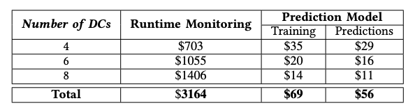
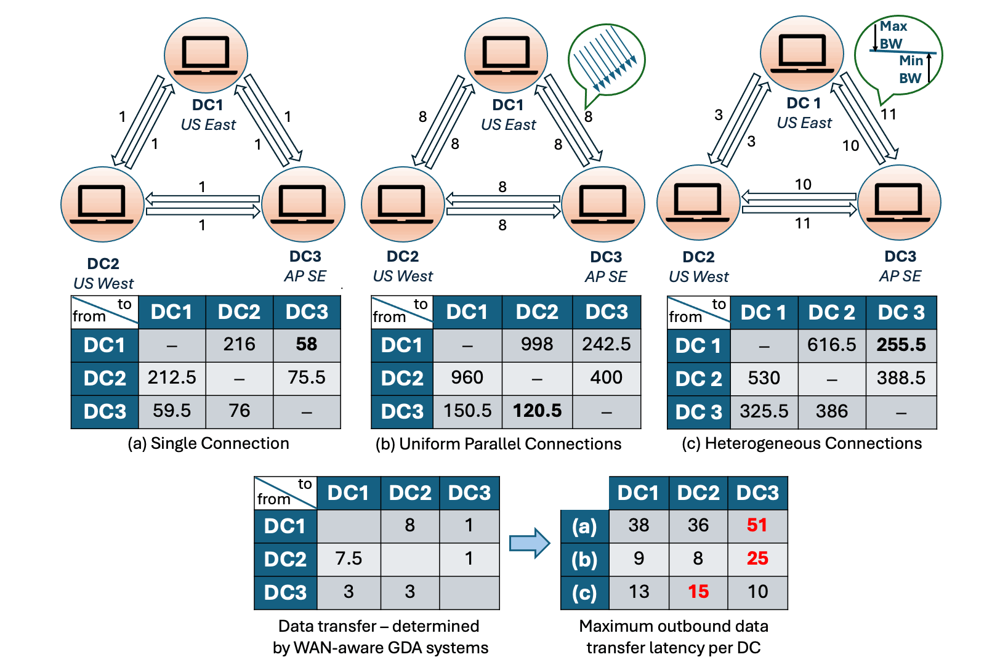
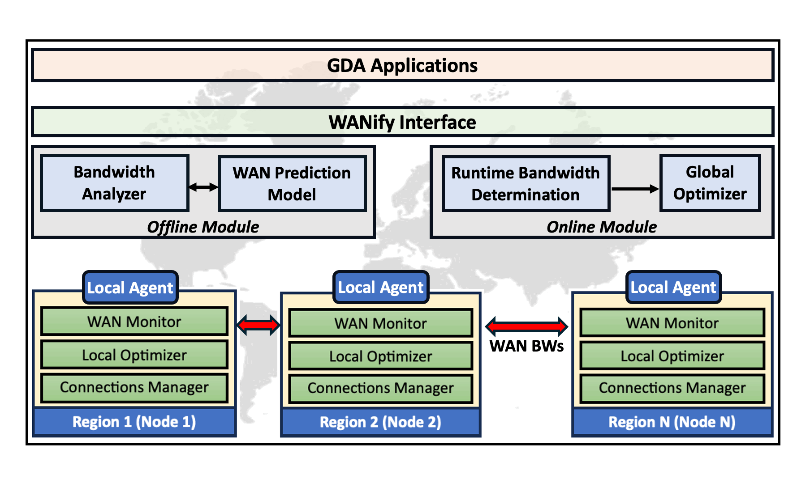

# Project Motivation
Many multi-region cloud applications generate large-scale data in a geo-distributed manner. To comply with regional data protection laws and achieve the desired performance, these applications rely on geo-distributed data analytics (GDA) to gain meaningful and timely knowledge from a highly dispersed large volume of data. Consequently, since these results are used to make important decisions affecting revenues and system health, improving their performance is a critical goal. 

While de-facto data processing frameworks, like Hadoop and Spark, have been widely used for analytics jobs, they are known to be ineffective in GDA. This is because large data must be transferred via wide area network (WAN), one of the most scarce and expensive resources. Thus, existing GDA systems consider heterogeneous BW while making optimal decisions, e.g., task and data placement, that minimize data transfer via weak WAN links to avoid the performance bottlenecks, i.e., heterogeneous BW-aware approaches. However,these systems measure BW between the virtual machines (VMs) deployed in geo-distributed DCs *statically* and *independently* using host-based network tools, e.g., iPerf. They use these BWs as inputs for making optimal BW-aware decisions at several stages of a GDA query. Such an approach assumes that runtime BW during query execution will be the same with (or similar to) the statically measured BW. This assumption, however, could easily become *false* because data transfer occurs *dynamically* and *simultaneously* in GDA (especially shuffle stages). Our preliminary experiments confirmed that statically and independently measured BWs do not represent runtime BW. This implies that existing BW-aware GDA systems may have produced sub-optimal solutions due to inaccurate BW values, which limits their performance gains. While measuring BWs across all DC pairs concurrently could provide accurate runtime BW, it incurs significant costs as demonstrated in the table below. For details on how these values were derived, we encourage the readers to follow our paper linked below.

<p align="center">
  
</p>

Therefore, gauging runtime BW precisely would be highly desirable for them to make optimal decisions while avoiding cost bottlenecks. The gains from these systems could be further sub-optimal because they use a *single connection* to transfer data across DC-pairs, which cannot capture available BW between the distant DCs. An example below with real-world metrics illustrates the potential of heterogeneous connections in improving the minimum network throughput of a cluster.



However, obtaining accurate runtime BWs and fully utilizing available BW are far from trivial. That is, gauging runtime BW precisely is challenging as BW is affected by several metrics such as the number of active peers and channel utilization of each peer. To improve WAN performance, one may uniformly increase the connections for each DC pair. However, this would incur a *BW-starvation* between distant DCs as nearby DCs occupy most of the available network, i.e., race condition and network contention. Thus, a heterogeneous number of connections should be determined optimally. This approach, however, is exponentially complex, e.g., $10^{240}$ different possibilities with 240 peering connections for two workers in each of the 8 different regions (with a maximum of 10 parallel connections between each DC-pair). Lastly, dynamics and heterogeneity in GDA, e.g., fluctuating BWs, varying number of DCs (and VMs), and input data skewness, make it impossible to determine optimal decisions statically.

# WANify
To address these challenges, we present a new WAN framework called *WANify*. WANify gauges runtime BW based on real-time snapshots and diverse inputs, e.g., number of DCs and their physical distance, which allows GDA systems to make optimal decisions by using accurate BWs. Also, WANify actively determines optimal and heterogeneous number of connections across all the peer-to-peer DC links. These determinations rely on the *achievable* predicted BW in order to improve weak WAN links, which would improve overall query latency by fully exploiting the WAN capacities. In addition, WANify uses a distributed agent-based model for handling dynamics and considers many forms of heterogeneity, such as skewed data, heterogeneous compute resources, and a varying number of DCs, while making optimal decisions. Note that WANify considers WAN performance of VMs as a user of cloud providers. Thus, it does not change anything below the application layer and because of its lightweight and orthogonal design, it can be easily integrated into any GDA system. A high-level architecture of WANify is shown below. For more details, please refer to our research paper.



# More on WANify
"WANify" is a tool based on top of iPerf 3.0, which measures accurate runtime bandwidths (BWs) for a cluster. It supports a decision tree-based Random Forest (RF) model for low-cost and precise prediction of runtime BWs by utilizing short-duration (1s) snapshot BWs. The choice of features in RF, such as the physical distance between datacenters (DCs) and the number of DCs, help adapt to various cluster sizes and multiple cloud providers. Moreover, the tool supports periodic monitoring, that is, it can be configured to collect additional static/dynamic/snapshot datasets at fixed intervals. The goal of this tool is to help Geo-distributed Data Analytics (GDA) applications in determining actual runtime BWs for network-aware policies.

# Configurations
All configurations related to the tool can be found inside config.cfg. One of the important configurations is the image ID for respective regions, i.e., AWS us-east-1: <image_id>, etc. Such information is essential to launch instances from scratch that will be used during monitoring. An easy way to accomplish this for the entire cluster is by copying the image from one region to all other required regions. Each image must contain Python 3.0 and iPerf 3.0. Additional steps can be found in <provider>/setup/README.txt.

Files, such as 'src/predict/livePredictor.py', 'src/predict/rfTrain.py', 'src/predict/genRefactoringVector.py' and 'src/optimization/greedyOptimization.py' contain path information, which might need to be updated after cloning this project. This is only required once when setting up the project.

# BW Monitoring and Model Generation
Additional datasets can be generated by running the following command from the project's home directory.

```python3 src/main.py```

# Generating Refactoring-vector
A "refactoring-vector" is required when the type of DCs to be used in model prediction have proportionally different BWs than the DCs that were originally used for model training. E.g., AWS DCs that have 200-400 Mbps BW were used initially for model training, but the model is now used for predicting runtime BWs in a multi-cloud cluster (consisting of both AWS and Google Cloud). If in this case, Google Cloud DCs typically have 400-600 Mbps BW, then refactoring is necessary. By default, the dependent codes and the model implicitly support a refactoring-vector of all 1s.

```python3 src/predict/genRefactoringVector```

# Predicting Runtime BW
Note that re-generation of the prediction model might be required when scikit-learn libraries are different between the generated model and the user's workspace. If that is the case, set both 'buildModel' and 'trainModeOnly' keys to 'True' (in config.cfg) and run the following command.

```python3 src/main.py```

To predict the runtime BW for a cluster, run the following command. Here <mode> can take one value from the set {1, 2, 3}. 1 removes the monitoring files after prediction, 2 persists the monitoring files after prediction and 3 predicts the runtime BWs based on the persisted monitoring files. This is done to ensure light-weight monitoring support for continuous periodic monitoring (in the interval of minutes, hours, etc.).

```python3 src/predict/livePredictor.py <mode>```

# Refer our work
If you are using our work or are motivated by it, please use the format below:

# Sponsor
<p align="left">
  
</p>

This material is based upon work supported by the National Science Foundation under Grant **[CNS-2153422](https://www.nsf.gov/awardsearch/showAward?AWD_ID=2153422)**. Any opinions, findings, and conclusions or recommendations expressed in this material are those of the author(s) and do not necessarily reflect the views of the National Science Foundation. <br>


**WANify is developed by the [Multi-cloud Computing Lab (MC2Lab)](https://sites.google.com/view/mc2lab) at the University of Nebraska Omaha.**

